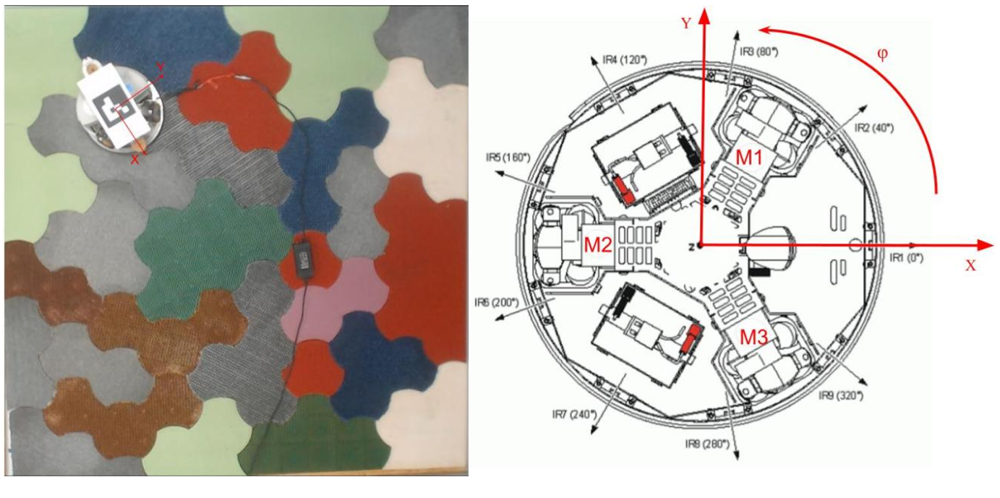
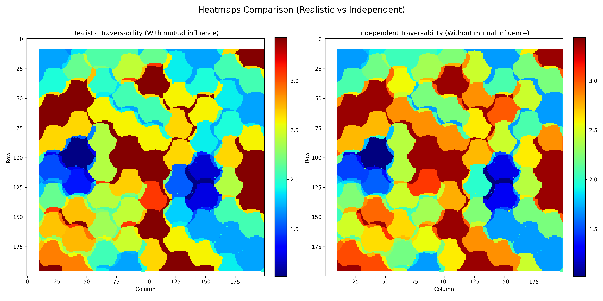

# Планирование пути с учетом вазаимовлияния участков на энергозатрат для робота с всенаправленными колесами

Этот проект - эмулятор всенаправленного робота на Python для планирования пути, движущегося по разноцветной поверхности. Он использует модели машинного обучения для оценки тока двигателей на основе типа поверхности и скорости, а также реализует различные алгоритмы планирования пути:

- **Реалистичный режим (Realistic)**: учитывает взаимное влияние участков на параметры движения робота.
- **Независимый режим (Independent)**: рассматривает каждое колесо отдельно (не учитывает взаимное влияние участков на параметры движения робота).



---

## 📂 Структура проекта

```plaintext
.
├── main.py                # Интерфейс для запуска Dijkstra, A*, D* и прямого пути
├── main_ga.py            # Интерфейс для запуска Генетического Алгоритма (GA)
├── build_heatmaps.py     # Генерация и сравнение тепловых карт стоимости
├── func.py               # Основная логика и построение графов
├── func_ga.py            # Генетический алгоритм: операторы и оптимизатор
├── img_to_array.py       # Конвертация изображения местности в RGB-массив
├── data.csv              # Датасет для обучения моделей
├── Datasets              # Все датасетов для обучения моделей
├── models/
│   ├── model_V_real_to_V_in.keras   # Прогнозирует внутренние скорости колес
│   └── model_currents.keras         # Прогнозирует потребление тока
└── env_arrays/
    ├── polygon_3.npy / polygon_4.npy / real_polygon.npy   # Карты местности в RGB

```

---

## 🚀 Возможности

- 🧠 **Построение графа** на основе нейронных сетей:
  - Реальные скорости вращения колес → желаемые скорости вращения колес
  - Желаемые скорости вращения колес + цветы поверхностей → токи двигателей
- 🛣️ **Алгоритмы планирования пути**:
  - Dijkstra
  - A*
  - D*
  - Генетический Алгоритм
- 📉 **Учет энергозатрат**:
  - Поверхность и скорость влияют на итоговую стоимость пути
  - Рассчитываются суммы токов двигателей и средняя мощность робота на пути
- 🌈 **Два режима построения графа**:
  - Реалистичный (С учетом взаималияния) и Независимый (Без учета взаимовлияния) 
- 🔥 **Визуализация в виде тепловых карт**

---

## 🖥️ Как запустить

### 1. Установка зависимостей

```bash
pip install numpy pandas pygame matplotlib scikit-learn keras pillow
```

### 2. Подготовка карты местности

Преобразуйте изображение в RGB-массив:

```bash
python img_to_array.py
```

Создаст файл `real_polygon.npy` в `env_arrays/`.

### 3. Запуск интерфейса Dijkstra / A* / D*

```bash
python main.py
```

- 🖱️ Левая кнопка: выбрать старт  
- 🖱️ Правая кнопка: выбрать цель  
- ⌨️ Горячие клавиши:
  - `1`: Реалистичный режим
  - `2`: Независимый режим
  - `SPACE`: запустить **Dijkstra**
  - `A`: запустить **A***
  - `D`: запустить **D***
  - `ENTER`: кратчайший путь

### 4. Запуск Генетического Алгоритма (GA)

```bash
python main_ga.py
```

- 🖱️ Левая кнопка: старт  
- 🖱️ Правая кнопка: цель  
- ⌨️ Клавиши:
  - `1`: GA с **реалистичной** моделью
  - `2`: GA с **независимой** моделью

### 5. Генерация тепловых карт стоимости

```bash
python build_heatmaps.py
```

Будет создано изображение для сравнения двух моделей графа.

---

## 📊 Используемые модели

- `model_V_real_to_V_in.keras`: прогнозирует внутренние скорости колес  
- `model_currents.keras`: прогнозирует токи двигателей на основе скорости и цвета поверхности

---

## 🧪 Заметки

- Цвета поверхности должны соответствовать заранее определённым RGB-значениям (например: `lightgreen`, `darkgray`, и т.п. - смотрите на `func.py`)
- Разрешение графа регулируется параметрами `rows`, `cols`, `cell_size`
- Стоимость пути определяется на основе суммарного тока по маршруту

---

## 📸 Скриншот (heat map)



